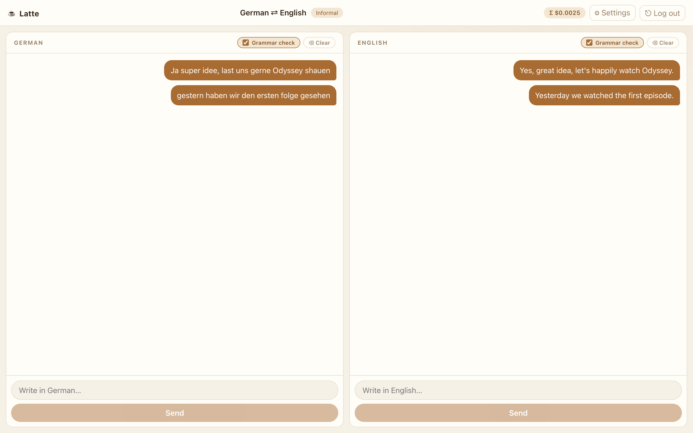

# ☕ Latte

A two-pane chat translator for language pairs, powered by OpenRouter. Type in either pane, pick from three natural translations, and let the optional grammar check catch mistakes before anything is sent. Fully frontend: no backend, no accounts, nothing stored outside your browser.

| | |
| --- | --- |
|  |  |
|  |  |

## Features

- **One-click sign-in**: "Sign in with OpenRouter" creates and stores an API key automatically via OpenRouter's PKCE flow; pasting an existing key still works
- **Any language pair**: pick a source and target language, swap them anytime, and keep a separate conversation per pair
- **Type in either pane**: write in your language or theirs; on phones the panes stack vertically
- **Three options every time**: each message arrives as three translation alternatives; pick the best fit or tap "None of these" for three fresh attempts
- **Optional grammar check**: a per-pane toggle that reviews your draft with a checker model; if it finds mistakes you get up to three corrected versions, and you can send as is, dismiss, or edit
- **Formal or informal**: choose the tonality your translations should carry
- **Your models**: translation can use any OpenRouter text model, while the grammar check is limited to typed decision models that answer with probabilities instead of text (defaults: `z-ai/glm-5.3-flash` for translation, `~typesafe/jev-latest` for checks)
- **Cost transparency**: a running total of API spend sits in the header
- **Copy any bubble**: hover a bubble and tap the copy glyph to put its text on the clipboard
- **Light or dark**: theme toggle on the login screen and beside the cost header; starts in light mode until you choose, then your choice persists in this browser
- **Tidy controls**: delete any bubble, clear one pane, or log out to wipe your data (your theme preference is kept)
- **Local first**: the API key, settings, chats, and costs live in localStorage only; logging out clears them all
- **Errors handled**: failed requests offer a retry without losing your draft

## Use it now

1. Open https://latte.donnie.in
2. Click "Sign in with OpenRouter", log in, and authorize — Latte creates and stores the key for you automatically
3. Choose your languages and tonality, and start chatting

You can also paste an existing OpenRouter key instead. Your key, chats, and spend total are stored only in this browser. Log out to erase them (your theme preference is kept).

## Development

```bash
npm install
npm run dev
```

Regenerate the screenshots above with Playwright: run `npm run screenshots` while a preview server is up on port 4173.

Deploy: push to `main` and the included workflow builds and publishes the site. Enable it under Settings, Pages, Build and deployment, Source: GitHub Actions. Your API key never leaves the browser, so no repository secrets are needed.

## Stack

Vite 7, React 19, TypeScript, CSS Modules, Playwright for screenshots. No backend, no database, no tracking.
