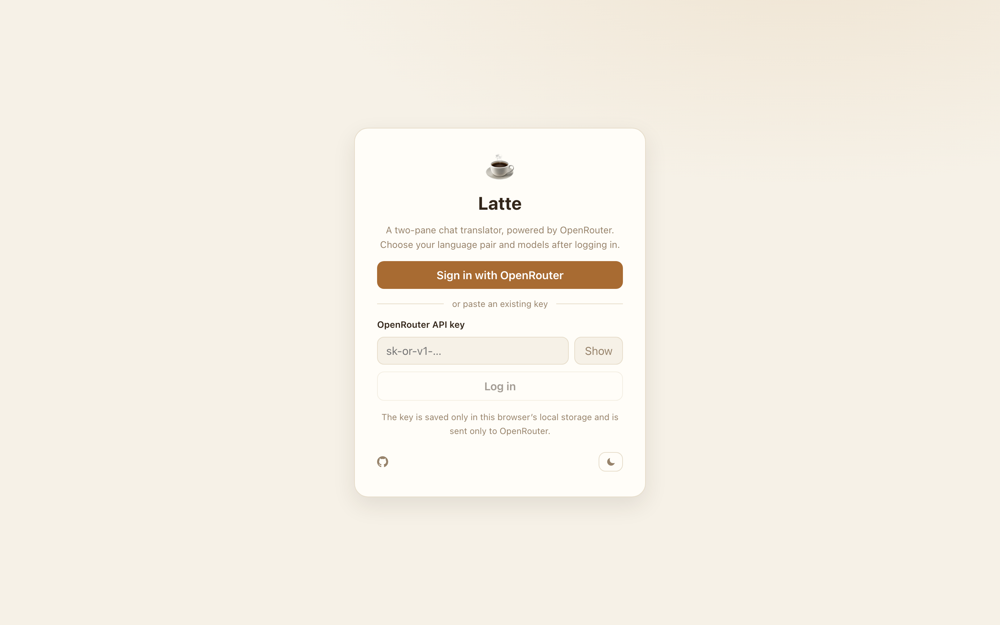
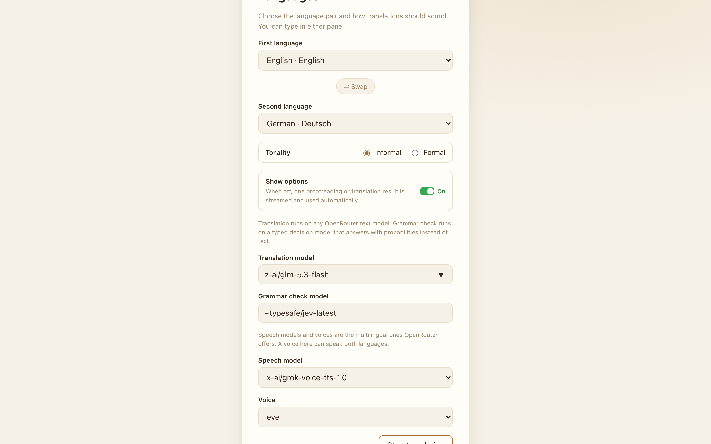
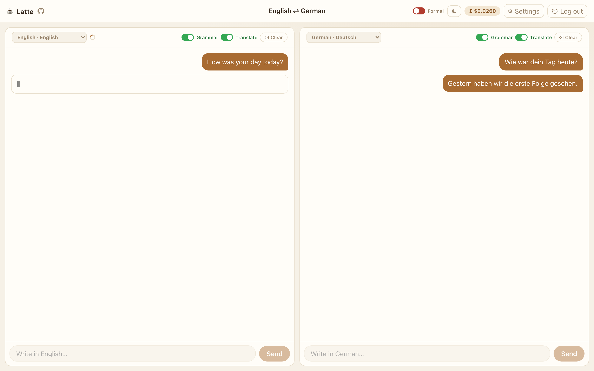
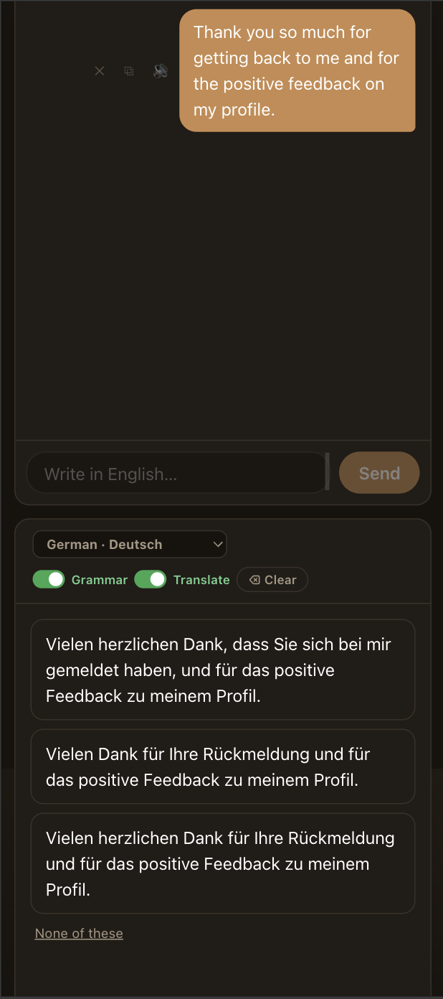

# ☕ Latte

A two-pane chat translator for language pairs, powered by OpenRouter. Type in either pane, pick from three natural translations, let the optional grammar check catch mistakes before anything is sent, and play any message aloud. Fully frontend: no backend, no accounts, nothing stored outside your browser.

## Desktop

| | |
| --- | --- |
|  |  |
|  | |

## Mobile

| |
| --- |
|  |

## Features

- **One-click sign-in**: "Sign in with OpenRouter" creates and stores an API key automatically via OpenRouter's PKCE flow; pasting an existing key still works
- **Any language pair**: pick a source and target language on the setup screen, or change either one from the dropdown in that pane’s header. The other pane’s language is disabled in the list. Swap the pair on the setup screen. Each pair keeps its own conversation
- **Type in either pane**: write in your language or theirs; on phones the panes stack vertically
- **Three options, or one**: with "Show options" on (the default), each message arrives as three translation alternatives; pick the best fit or tap "None of these" for three fresh attempts. Turn it off and a single proofreading or translation result is streamed and used automatically. If every alternative collapses to the same text, that text is used automatically too
- **Optional grammar check**: a per-pane toggle that reviews your draft with a checker model; if it finds mistakes you get up to three corrected versions, and you can send as is, dismiss, or edit
- **Optional translation**: a per-pane Translate toggle next to Grammar, on by default. Turn it off and a sent message stays in that pane, with the grammar check when that toggle is on, and no translation is requested. A translation already on screen keeps its Retry button
- **Formal or informal**: choose the tonality your translations should carry, on the setup screen or with the Formal switch in the chat header
- **Your models**: translation can use any OpenRouter text model, the grammar check is limited to typed decision models that answer with probabilities instead of text, and speech uses a multilingual OpenRouter speech model plus one of its voices (defaults: `z-ai/glm-5.3-flash` for translation, `~typesafe/jev-latest` for checks, `x-ai/grok-voice-tts-1.0` with the `eve` voice)
- **Listen to any bubble**: hover a bubble and tap the speaker to play it; pause, resume, or replay while it is active. Audio is generated on demand and cached for the session
- **Cost transparency**: the header shows this API key’s all-time OpenRouter usage. It loads on login, refreshes after each request, and updates again when you click it. The reading stays in this browser until you log out
- **Copy any bubble**: hover a bubble and tap the copy glyph to put its text on the clipboard
- **Light or dark**: theme toggle on the login screen and beside the cost header; starts in light mode until you choose, then your choice persists in this browser
- **Tidy controls**: delete any bubble, clear one pane, reopen settings, or log out to wipe your data (your theme preference is kept)
- **Local first**: the API key, settings, chats, and costs live in localStorage only; speech audio stays in memory for the session. Logging out clears them all
- **Installable**: the built site is a PWA, so you can add it to your home screen
- **Errors handled**: failed requests offer a retry without losing your draft

## Use it now

1. Open https://latte.donnie.in
2. Click "Sign in with OpenRouter", log in, and authorize — Latte creates and stores the key for you automatically
3. Choose your languages and tonality, and start chatting

You can also paste an existing OpenRouter key instead. Your key, chats, and the last usage reading are stored only in this browser. Log out to erase them (your theme preference is kept).

## Development

```bash
npm install
npm run dev
```

Regenerate the screenshots above with Playwright: run `npm run screenshots` while a preview server is up on port 4173. The script drives the real app from scratch — login, setup, and live conversations — using the OpenRouter key from `.env` (`KEY=…`) or `OPENROUTER_API_KEY`, so it makes real API calls and incurs a tiny amount of spend.

Deploy: push to `main` and the included workflow builds and publishes the site. Enable it under Settings, Pages, Build and deployment, Source: GitHub Actions. Your API key never leaves the browser, so no repository secrets are needed.

## Stack

Vite 7, React 19, TypeScript, CSS Modules, an installable PWA, Playwright for screenshots. No backend, no database, no tracking.
